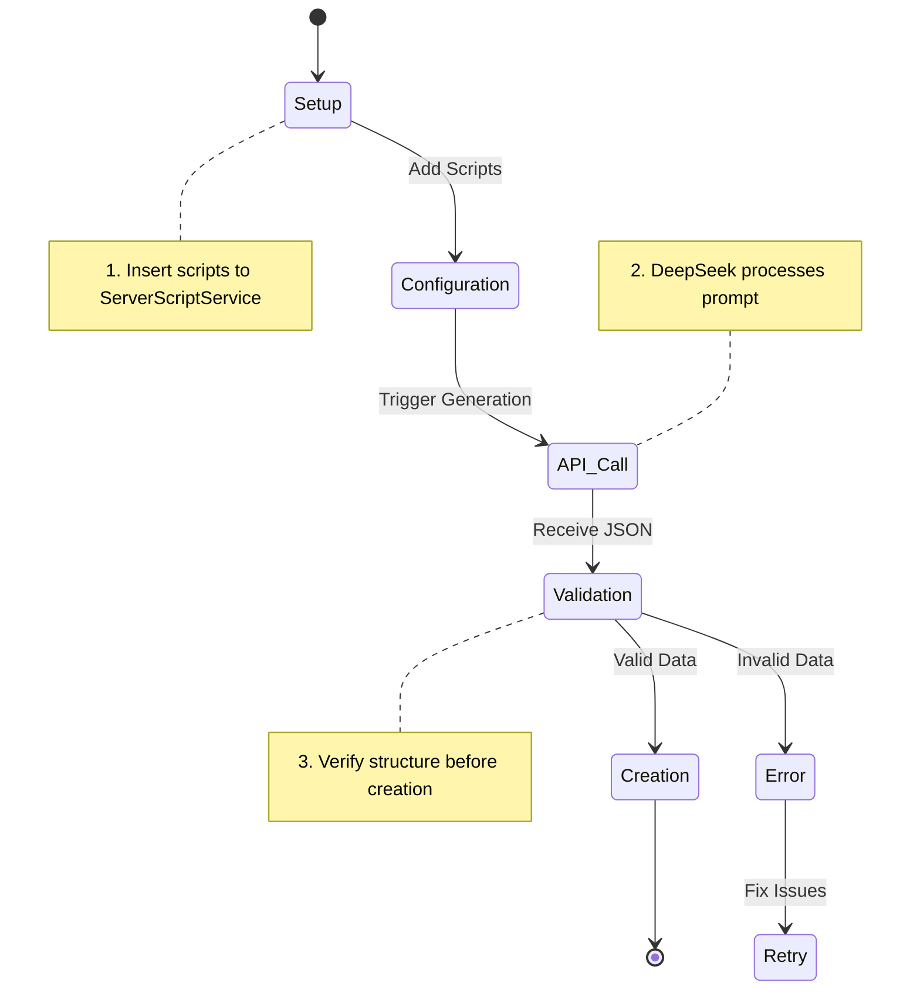

# Roblox DeepSeek Integration 🚀


## 🌟 Key Features
| Feature | Description |
|---------|-------------|
| **AI-Powered Content** | Generate 3D objects via natural language prompts |
| **Real-Time Creation** | Dynamic part generation during gameplay |
| **Secure API** | Encrypted HTTP requests with key management |
| **Debug Tools** | Built-in JSON validation and error logging |

## 📋 Prerequisites
- [Roblox Studio](https://create.roblox.com/)
- [DeepSeek API Key](https://platform.deepseek.com/)
- Basic Lua knowledge

---

## 🛠️ Comprehensive Setup Guide

### 1. Repository Setup
```bash
git clone git@github.com:yllvar/Roblox-DeepSeek-Integration.git
cd Roblox-DeepSeek-Integration
```

### 2. File Structure
```
roblox-place/
└── ServerScriptService/
    ├── DeepSeekHelper.module.lua
    └── SpinPartGenerator.server.lua
docs/
└── SETUP.md
```

### 3. Implementation Steps

#### A. Configure DeepSeek Helper
1. In Roblox Studio:
   - Open **Explorer** (View → Explorer)
   - Right-click **ServerScriptService** → **Insert Object** → **ModuleScript**
   - Rename to `DeepSeekHelper`
   - Paste the following code:

```lua
local HttpService = game:GetService("HttpService")
local API_URL = "https://api.deepseek.com/v1/chat/completions"

-- PRO-TIP: Use environment variables for API keys
local API_KEY = _G.DEEPSEEK_KEY or "your_api_key_here"

local function callDeepSeek(prompt)
    -- ... [rest of the original code] ...
end

return callDeepSeek
```

#### B. Create Generator Script
1. In **ServerScriptService**:
   - Insert new **Script** named `SpinPartGenerator`
   - Use this enhanced template:

```lua
local callDeepSeek = require(script.Parent.DeepSeekHelper)

-- Optimized prompt with strict formatting
local prompt = [[
Return STRICT JSON for a Roblox Part with:
- Size: 5x1x5
- Position: (0,10,0)
- Color: RGB(0,255,0)
- Spinning behavior
FORMAT:
{
    "Size": {"X":5,"Y":1,"Z":5},
    "Position": {"X":0,"Y":10,"Z":0},
    "Color": {"R":0,"G":1,"B":0},
    "Name": "AISpinner",
    "Anchored": true
}]]

local function createSpinningPart(data)
    local part = Instance.new("Part")
    -- ... [property assignment] ...
    
    -- Smooth rotation with delta time
    local lastUpdate = os.clock()
    while part.Parent do
        local delta = os.clock() - lastUpdate
        part.CFrame = part.CFrame * CFrame.Angles(0, math.rad(45)*delta, 0)
        lastUpdate = os.clock()
        task.wait()
    end
end

-- Main execution flow
local response = callDeepSeek(prompt)
if response then
    local success, partData = pcall(function()
        return game:GetService("HttpService"):JSONDecode(
            response:gsub("```json", ""):gsub("```", "")
        )
    end)
    
    if success then
        createSpinningPart(partData)
    else
        warn("JSON Parse Error:", partData)
    end
end
```

#### C. Enable HTTP Requests
1. Go to:
   - **File** → **Game Settings** → **Security**
   - ✔️ Enable **"Allow HTTP Requests"**
   - Click **Save**

---

## 🔄 Workflow Diagram



## 🚦 Execution Flow
1. **Initialization**  
   - Scripts load when game starts
   - API key authentication check

2. **Content Generation**  
   ```mermaid
   graph LR
       A[Player Joins] --> B[Server Calls DeepSeek]
       B --> C{API Response?}
       C -->|Success| D[Create Part]
       C -->|Failure| E[Log Error]
   ```

3. **Debugging**  
   Check **Output** (F9) for:
   - API response status
   - JSON parsing results
   - Part creation logs

---

## 📚 Additional Resources
- [DeepSeek API Docs](https://platform.deepseek.com/docs)
- [Roblox HTTP Service](https://create.roblox.com/docs/reference/engine/classes/HttpService)
- [Example Prompts](docs/PROMPT_EXAMPLES.md)

## 🚨 Troubleshooting
| Error | Solution |
|-------|----------|
| `HTTP 403` | Verify API key & enable HTTP requests |
| `Invalid JSON` | Use the strict formatting guide |
| `No Part Created` | Check Output for generation logs |

---

> 💡 **Pro Tip**: For production games, use a [proxy server](docs/PROXY_SETUP.md) to secure your API key!

